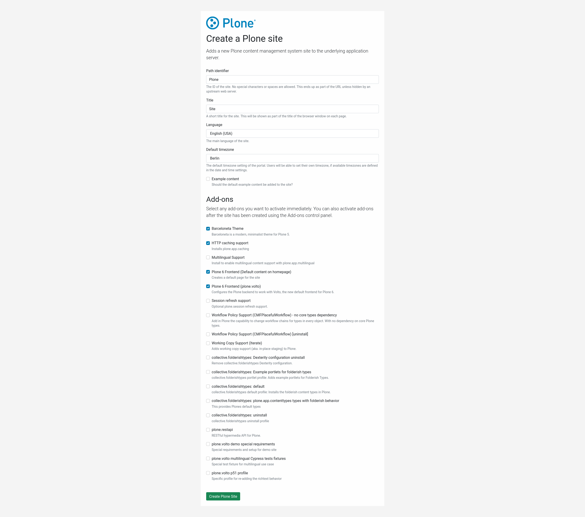

# Setup with Webserver (Nginx), Frontend(Volto), and Plone Backend

## Intro

Clone this repository and go to the `examples/webserver-volto-plone` folder

```shell
git clone https://github.com/plone/plone-frontend.git
cd plone-frontend/examples/webserver-volto-plone
```

Start the solution with `docker-compose` (or `docker compose` for newer versions)

```shell
docker-compose up -d
```

## Configure Plone backend

In a browser, go to [http://localhost:8080/@@plone-addsite?site_id=Plone&advanced=1](http://localhost:8080/@@plone-addsite?site_id=Plone&advanced=1) and create a new site:



After the Plone site is created, go to `http://localhost/` and you should see the site.
